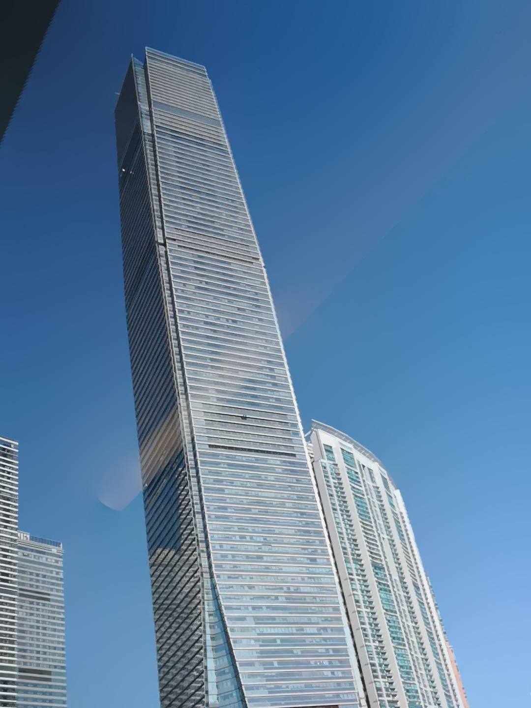
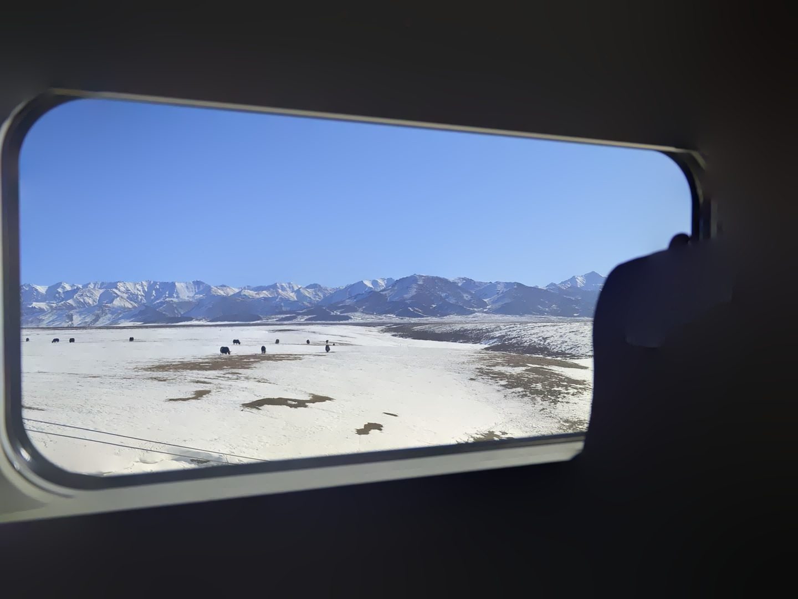
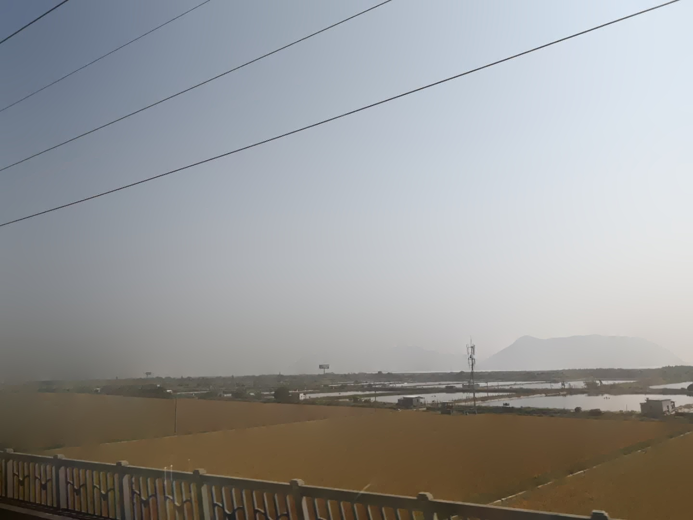

# reflectSuppress-python
This is a **Python** implementation of the paper:

[**Fast Single Image Reflection Suppression via Convex Optimization**](https://openaccess.thecvf.com/content_CVPR_2019/papers/Yang_Fast_Single_Image_Reflection_Suppression_via_Convex_Optimization_CVPR_2019_paper.pdf)

from the MATLAB code at [https://github.com/yyhz76/reflectSuppress](https://github.com/yyhz76/reflectSuppress).


## Prerequisites

The experiments were built using **Python 3**, with some libraries: **numpy, scipy,  opencv and PyWavelets**. It is required to install these libraries to run the code.

* [numpy](http://www.numpy.org/) - Scientific computing library for Python
* [scipy](https://www.scipy.org/) - Ecosystem of open-source software for mathematics, science, and engineering
* [opencv](https://www.opencv.org/) - Open Source Computer Vision Library
* [PyWavelets](http://matplotlib.org/) - a scientific Python module for Wavelet Transform calculations

All of these libraries could be installed using [pip](https://pypi.python.org/pypi/pip) (Python Package Index).

```
sudo -H pip install numpy scipy opencv-python PyWavelets
```


## Running

A running example can be found into the script folder, under the `main.py` file.


## Results

Original images | After supression
--- | ---
 | 
 | 
 | 


